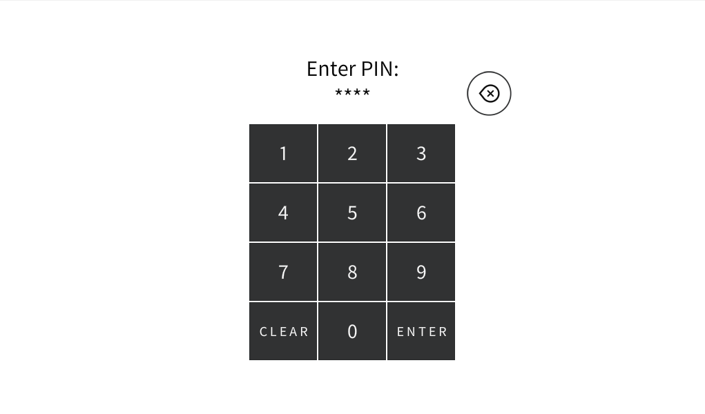

# Crestron-Ssharp-Pincode
Crestron S#pro pincode utility class

# About
S#Pro class for Crestron control systems to provide simple authentication for Crestron touch panels.

# Example
Instantiate the Pincode class by passing a BasicTriList/BasicTriList derived class (in this example an Xpanel), the serial join number to output the pincode text to (uint), and the default password (string).
```c#
private XpanelForSmartGraphics xpanel;
private Pincode pincode;

pincode = new Pincode(xpanel, 1, "1234");
```

Optional features include enabling a backdoor password, setting the maximun pincode limit (default is 4) and enable the password to be displayed as '*''s in place of digits.
```c#
pincode.EnableBackdoorPassword("1988");
pincode.SetPinLimit(4);
pincode.EnableStarText();
```

Callback functions can be assigned to Action delegates for specific events when the pincode matches the password or SmartGraphic button presses.
```c#
pincode.PasswordMiscOneDelegate = DoSomething;
pincode.PasswordMiscTwoDelegate = () => pincode.ValidatePINEntry();
pincode.PasswordCorrectDelegate = () => xpanel.StringInput[1].StringValue = "Password Correct";
pincode.PasswordIncorrectDelegate = () => xpanel.StringInput[1].StringValue = "Password Incorrect";

public void DoSomething() { pincode.ClearText(); }
```


